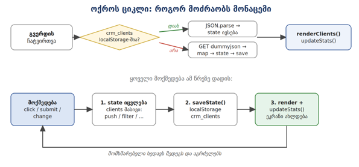

10X JavaScript გამოცდა - „10X CRM" Product Requirements Document (PRD)
ინდივიდუალური პროექტი ვერსია 3.0

------------------------------------------------------------------------

# 1. შესავალი

ეს არის პროდუქტის მოთხოვნების დოკუმენტი (PRD) JavaScript მოდულის
დასკვნითი გამოცდისთვის. პირველი გამოცდა გართობა და ვიზუალური
დემონსტრაცია იყო. ახლა უკვე პროგრამირების ენაც იცი და რეალისტურ დავალებს
შეეჭიდე. გამოცდის ტიპი დაფუძნებულია რეალურ დეველოპერულ გამოცდილებაზე თუ
რას აკეთებ როგორც დეველოპერი ყოველკვირეულ პროგრესში. წარმოიდგინე, რომ
დეველოპერი ხარ კომპანიაში და პროდუქტ-მენეჯერმა გადმოგცა ეს დოკუმენტი: აქ
წერია ყველაფერი - რა გვერდები უნდა ჰქონდეს პროდუქტს, რა ველები, რა
წესებით მოწმდება ისინი და რა ხდება ყოველ ღილაკზე დაჭერისას. შენი საქმეა
სწორად გაარჩიო, დაგეგმო პროცესი და დაიწყო შენება. პროდუქტი: „10X CRM" -
კლიენტებთან ურთიერთობის მართვის სისტემა გაყიდვების მენეჯერებისთვის. ასეთ
სისტემებს ყოველდღიურად იყენებს მილიონობით ადამიანი (Salesforce, HubSpot,
Pipedrive) - შენ ააშენებ მის გამარტივებულ, მაგრამ სრულფასოვან ვერსიას:
რეგისტრაციით, ავტორიზაციით, დეშბორდით, კლიენტების ბაზით და პროფილით.
გამოცდა აფასებს მოდულს „ვებგვერდის ინტერაქტიულობისა და ეფექტების შექმნა
JavaScript-ის საშუალებით" და ამავე პროექტში გაფასებს კიდევ ორ მოდულში:
„ხელოვნური ინტელექტის გამოყენება" და „დარგობრივი ინგლისური ენა" AI-ის
გამოყენება ნებადართულია. სრულად. არ შეგეშინდეს! ჩვენ ბევრი ვიმუშავეთ
AI-ის გამოყენების პრინციპებზე. შეგიძლია გამოიყენო ნებისმიერი AI
ინსტრუმენტი (Claude, ChatGPT, Copilot, Gemini...) ნებისმიერ ეტაპზე. ეს
არ არის „მოტყუება", შეგიძლია პროექტი სრულად AI-ის გააკეთებინო. ეს
თანამედროვე დეველოპერის სამუშაო პროცესია, მაგრამ ორი რამ ნამდვილად შენი
პასუხისმგებლობაა: - 1. პროდუქტი უნდა მუშაობდეს. ვებ-აპლიკაცია ბოლომდე
გამართული უნდა იყოს - AI-ის დაწერილი გაუმართავი კოდი შენი გაუმართავი
კოდია. პროდუქტი თუ არ მუშაობს არ აქვს მნიშვნელობა რამდენი დრო დახარჯე.
რეალურ პროექტზე KPI დაგიფეილდება და ბონუსსაც ვერ აიღებ (ცუდ შემთხვევაში
შესაძლოა ვერც ხელფასი) - 2. უნდა შეგეძლოს ახსნა რა გააკეთე. გამოცდაზე
შემფასებელი შენს კოდზე დაგისვამს კითხვებს. თუ ვერ ხსნი რას აკეთებს
შენივე კოდი - ქულა იკლებს, მიუხედავად იმისა, რამდენად კარგად მუშაობს
აპლიკაცია. ვალიდაცია შენს ნამუშევარს თავადვე გაატარე მარტივი ტესტით: თუ
დღეს კოდი შენ დაწერე ან დააწერინე AI-ს და ხვალ შეგიძლია მეგობარს აუხსნა
line-by-line - გამოცდისთვის მზად ხარ .

------------------------------------------------------------------------

# 2. გამოცდის სტრუქტურა (3 ეტაპი)

ეტაპი 1 - ინდივიდუალური ქვიზი:
 - 25 დახურული (multiple choice) კითხვა, 40
წუთი. 
 - თემატური განაწილება: 
     - ცვლადები/ოპერატორები (4), 
     - პირობითი ოპერატორები და ციკლები (5), 
     - მასივები და ობიექტები (5), 
     - ბრაუზერის ფუნქციები / ტაიმერები / storage (4), 
     - DOM და events (4), 
     - ასინქრონულობა და fetch (3). ზღვარი 60%. 
 - ეტაპი 2 - ინდივიდუალური პროექტი:
     - თითოეული სტუდენტი აშენებს საკუთარ 10X CRM-ს ამ PRD-ის მიხედვით. 
     - რეკომენდებული ხანგრძლივობა: 8-10 სამუშაო დღე (გეგმას ნახავ - სექცია 8-ში).
     - პროექტი სოლო რეჟიმში მიმდინარეობს; ერთმანეთის დახმარება წახალისებული იქნება (იხ. „თანადგომის კულტურა" ქვემოთ.) 
 - ეტაპი 3 - ინდივიდუალური დემო და გამოცდა (10--15 წუთი).
1. ლაივ დემო (5 წთ): სრული ფლოუ - რეგისტრაცია -\> ლოგინი -\> დეშბორდი -\> კლიენტის დამატება/წაშლა/ფილტრი -\> პროფილი -\> ლოგაუთი -\> გადატვირთვის შემდეგ მონაცემები ადგილზეა უნდა რჩებოდეს.
(სად შეინახავ თავად გადაწყვიტე, მაგრამ უნდა ახსნა)
2. კოდის ახსნა (5 წთ): შემფასებელი ირჩევს კოდის 2-3 ადგილს. შესაძლოა დაისვას კითხვები:
    - რას აკეთებს ეს ფუნქცია?", „რატომ არის აქ async/await?",
    - „სად ინახება სესია და რატომ?"
3. მინი ლაივ ცვლილება (3-5 წთ): 
    - ერთი პატარა,სამართლიანი ცვლილება (მაგ: „პაროლის მინიმალური სიგრძე 8-დან 10-ზე შეცვალე", „ფილტრს დაამატე ახალი სტატუსი"). ამ ეტაპზე არ იყენებ AI -ის. შეგიძლია დაგუგლო და გამოიყენო ნებისმიერი რესურსი გარდა AI-სა.
4. ინგლისური ნაწილი (1-2 წთ): აპლიკაციის აღწერა ინგლისურად - შესაძლებელია შემფასებელმა მოითხოვოს 1 წუთიანი სფიჩით ინგლისურ ენაზე აღწერო საკუთარი ნამუშევარი. გაითვალისწინე რომ კოდის კომენტარები და README ინლგისურად დაწერო.

------------------------------------------------------------------------

# 3. შეფასების კრიტერიუმები

-   კოდის ხარისხი - სუფთა, კითხვადი კოდი; ფუნქციებად დაშლილი, გასაგები
    სახელები და კომენტარები.
-   დავალების შესრულება - ამ PRD-ის მოთხოვნების დაკმაყოფილების ხარიხსი.
-   ტექნიკური ანალიზი - გამოცდაზე კოდის ახსნა, კითხვებზე პასუხები, ლაივ
    ცვლილებების განხორციელება. აქ მოწმდება, რომ AI-ს დახმარებით შექმნილი
    კოდი გააზრებული გაქვს.
-   GitHub commit ისტორია - ეტაპობრივი, შინაარსიანი კომიტები (მინიმუმ
    25). - სამუშაო ბევრი გაქვს, შესაბამისად კომიტების მოგროვება არ უნდა
    გაგიჭირდეს.
-   კრეატიულობა და დამატებითი ძალისხმევა - ბონუსები, გამორჩეული UX.

თითოეული კრიტერიუმი ფასდება 0-5 ქულით:

5 - სრულყოფილად + დამატებითი ძალისხმევა; 
4 - სრულად, მცირე ხარვეზებით;
3 - ძირითადი მოთხოვნები მცირე პრობლემებით; 
2 - ნაწილობრივ, მნიშვნელოვანი
ხარვეზებით; 
1 - მინიმალური ძალისხმევა; 
0 - არ შესრულებულა/არ წარდგენილა.

CORE და FULL დონეები დონე რას მოიცავს შედეგი
CORE (მინიმუმი)

------------------------------------------------------------------------

## P0 (გლობალური წესები), 
## P1 Sign Up, 
## P2 Login, 
## P4 Clients-ის ბირთვი (ჩატვირთვა, რენდერი, დამატება, წაშლა, შენახვა) + D1 ai-log + README (EN) + deploy

მოდულის ჩათვლის მინიმალური ზღვარი

FULL (სრული) CORE + P3 Dashboard, P4 Clients სრულად (ფილტრი/სორტი/ძებნა,
დეტალები/შენიშვნები/შეხსენება), P5 Profile, error handling + D2 სრული
ინგლისური პაკეტი მაღალი ქულების ზონა (4--5)

სტრატეგია: ჯერ CORE ბოლომდე, მერე FULL.

გაითვალისწინე: ბოლომდე მომუშავე ცოტა ფუნქცია ბევრად ფასობს, ვიდრე
ნახევრად მომუშავე ბევრი.

------------------------------------------------------------------------

# 4. თანადგომის კულტურა (ქულით არ ფასდება)

პროექტი ინდივიდუალურია, მაგრამ ერთმანეთის დახმარება წახალისებულია -
რეალურ გუნდებში ასე მუშაობენ. დახმარება არ ისჯება და ცალკე ქულითაც არ
ფასდება; ეს უბრალოდ ჯანსაღი სამუშაო კულტურის ნაწილია: - დახმარების
თხოვნა: გახსენი GitHub Issue საკუთარ რეპოზე - აღწერე პრობლემა, რა სცადე,
რა მიიღე. README-ის Credits სექციაში მიუთითე, ვინ დაგეხმარა და რაში - ეს
პატიოსნების ნიშანია და ქულას არანაირად არ გაკლებს. - დახმარება: უპასუხე
სხვის Issue-ს კომენტარით - ახსენი მიმართულება, კონცეფცია ან შეცდომის
მიზეზი, არა მზა გადაწყვეტა საილუსტრაციოდ შეგიძლია კოდითაც დაეხმარო
სხვას, თუმცა შესაძლოა შენი კოდის ახსნა მოუწიოს და ფრთხილად. სხვისი კოდის
ახსნა საკუთარი ცოდნის საუკეთესო ტესტია. - ერთი წითელი ხაზი: სხვის რეპოში
კოდის ჩაწერა და მთელი ფუნქციების „ჩუქება" დაუშვებელია - თუ ვერ სტუდენტი
ვერ ახსნის კოდს ჩაითვლება რომ არ ესმის რა დაწერა და არც ჩაეთვლება
ნამუშევარი.

------------------------------------------------------------------------

# 5. პროდუქტის მიმოხილვა

## 5.1 მომხმარებელი და პრობლემა

ჩვენი მომხმარებელია გაყიდვების მენეჯერი, რომელსაც ჰყავს ათობით
პოტენციური კლიენტი სხვადასხვა ეტაპზე: ზოგს ჯერ არ დაუკავშირდა, ზოგთან
მოლაპარაკებაშია, ზოგთან გარიგება დაიდო ან ჩაიშალა. Excel-ში ამის
თვალყურის დევნება ქაოსია. 10X CRM აძლევს მას: კლიენტების ერთიან ბაზას,
გარიგებების სტატუსების მართვის საშუალებას, შენიშვნებს კომენტარების
სახით, შეხსენებებს შეტყობინებებებად და შემაჯამებელ დეშბორდს.

## 5.2 გვერდების რუკა (Site Map)

პროდუქტი შედგება 5 გვერდისგან. თითო გვერდი ცალკე HTML ფაილია: გვერდი
ფაილი წვდომა დონე

------------------------------------------------------------------------

| გვერდი          | ფაილი            | წვდომა |    დონე     |
| --------------- | ---------------- | ------- | :----------: |
| P1 – Sign Up    | `signup.html`    | საჯარო |    CORE      |
| P2 – Login      | `index.html`     | საჯარო |    CORE      |
| P3 – Dashboard  | `dashboard.html` | დაცული |    FULL      |
| P4 – Clients    | `clients.html`   | დაცული | CORE + FULL  |
| P5 – Profile    | `profile.html`   | დაცული |    FULL      |

## რატომ არის Login = index.html? 
საიტის გახსნისას პირველი, რასაც
არაავტორიზებული მომხმარებელი ხედავს, ლოგინია - ეს სტანდარტული პრაქტიკაა.
ავტორიზებულ მომხმარებელს index.html ავტომატურად გადაამისამართებს
დეშბორდზე (იხ. P0). ბექენდი საჭირო არაა. მხოლოდ ფრონტითაც მიიღებთ ამ
შედეგს ან დამატებითი ძალისხმევის კრიტერიუმი რომ ჩაითვალოთ გამოიყენეთ
AI - სწორად.

დიაგრამა 1. გვერდების რუკა: მწვანე --- წარმატებული ავტორიზაციის გზა;
წითელი წყვეტილი --- Auth Guard-ის იძულებითი გადამისამართება; ყავისფერი
--- Logout.

## 5.3 ძირითადი ფლოუ (Happy Path)

-   1.  ახალი მომხმარებელი ხსნის საიტს -\> ხედავს Log In გვერდს -\> გადადის Sign Up-ზე -\> რეგისტრირდება.
-   2.  ლოგინდება -\> ხვდება Dashboard-ზე -\> ხედავს სტატისტიკას და ბოლო კლიენტებს.
-   3.  მომხმარებელი გადადის Clients გვერდზე -\> ბაზა ივსება API-დან -\> ეძებს, ფილტრავს, ამატებს ახალ კლიენტს, ცვლის სტატუსებს, წერს შენიშვნებს.
-   4.  მომხმარებელი Profile გვერდზე ასწორებს საკუთარ მონაცემებს, იცვლის პაროლს, ფერის თემას.
-   5.  გამოდის (Logout) -\> ისევ ლოგინდება -\> ყველა მონაცემი ადგილზეა.

## 5.4 მონაცემთა მოდელები და localStorage რეესტრი

| Key | რა ინახება  | როდის იწერება                                                                                                     |
|-----|------------|--------------------------------------------------------------------------------------------------------------------|
| `crm_users`      | რეგისტრირებული მომხმარებლების მასივი (User ობიექტები) | რეგისტრაციისას; პროფილის/პაროლის ცვლილებისას           |
| `crm_session`    | მიმდინარე სესიის ობიექტი — ვინ არის შესული | ლოგინისას იწერება; ლოგაუთისას იშლება                                 |
| `crm_clients`    | კლიენტების მასივი (Client ობიექტები) — აპლიკაციის მთავარი state | პირველი API ჩატვირთვისას და ყოველი ცვლილებისას |
| `crm_theme`      | `"dark"` ან `"light"` | თემის გადართვისას |

-   User ობიექტი (crm_users მასივის ელემენტი)

{ id: 1720180200000, // Date.now() რეგისტრაციისას fullName: "Nino
Beridze", email: "nino@example.com", // ინახება lowercase-ად password:
"pass1234", // იხ. უსაფრთხოების შენიშვნა ქვემოთ company: "10X Sales", //
შეიძლება იყოს "" createdAt: "2026-07-05T10:30:00.000Z" }

-   Session ობიექტი (crm_session)

{ userId: 1720180200000, email: "nino@example.com", loginAt:
"2026-07-05T10:31:00.000Z" }

-   Client ობიექტი (crm_clients მასივის ელემენტი)

{ id: 1, name: "Emily Johnson", // API: firstName + " " + lastName
email: "emily.johnson@x.dummyjson.com", phone: "+81 965-431-3024",
company: "Dooley, Kozey and Cronin", // API: company.name image:
"https://dummyjson.com/icon/emilys/128", status: "Lead", // "Lead" \|
"Contacted" \| "Won" \| "Lost" dealValue: 5000, // რიცხვი, \> 0 notes: \[ { text: "Called, interested", date: "05/07/2026, 14:22" } \], createdAt: "2026-07-05T10:30:00.000Z" } 

ოქროს ციკლი - დაიმახსოვრე ეს ერთი სურათი
 ქვემოთ მოცემული ციკლი მთელი აპლიკაციის გულია. ყველა ღილაკი, რომელსაც ამ დოკუმენტში შეხვდები, ბოლოს ზუსტად ამ ჯაჭვს გადის: state იცვლება -\> ინახება -\> ეკრანი თავიდან იხატება. თუ ეს გესმის - მთელი პროექტი გესმის.
 

-   უსაფრთხოების შენიშვნა (წაიკითხე აუცილებლად): რეალურ პროდუქტში პაროლის ღია ტექსტად შენახვა localStorage-ში კატეგორიულად დაუშვებელია - პაროლები ინახება სერვერზე, დაჰეშილი. ჩვენ ამას ვაკეთებთ მხოლოდ იმიტომ, რომ ეს სასწავლო პროექტია backend-ის გარეშე. გამოცდაზე ეს კითხვა შეიძლება დაგისვან: „რატომ არის ეს მიდგომა რეალურ პროდუქტში მიუღებელი?" - მოემზადე პასუხისთვის.

## 5.5 მონაცემების წყარო - DummyJSON API

-    კლიენტების საწყისი ბაზა იტვირთება DummyJSON-დან (dummyjson.com) - უფასო სატესტო API, რეგისტრაციისა და API key-ის გარეშე:
- GET https://dummyjson.com/users?limit=30 - 30 რეალისტური მომხმარებელი.
- POST https://dummyjson.com/users/add - ახალი ჩანაწერის დამატება.
- DELETE https://dummyjson.com/users/{id} - ჩანაწერის წაშლა. 
მნიშვნელოვანი ინფო: DummyJSON ჩაწერის ოპერაციებს (POST/DELETE) 
იმიტირებულად ამუშავებს - რექვესთს იღებს და კორექტულ პასუხს აბრუნებს, მაგრამ ბაზაში არ ინახავს. ეს ჩვენთვის იდეალურია: შენ სწავლობ სერვერთან სრულ კომუნიკაციას, რეალურად დამახსოვრებას კი localStorage აკეთებ. API-ს პასუხში კლიენტების მასივი დევს data.users ველში, კომპანიის სახელი - user.company.name-ში.

## 5.6 ტექნიკური შეზღუდვები

-   მხოლოდ Vanilla JavaScript - ფრეიმვორკები (React, Vue) და
    ბიბლიოთეკები (jQuery) აკრძალულია. 
-   CSS ან SCSS --- შენი არჩევანია.
-   რეკომენდებული ფაილური სტრუქტურა: 
    -   index.html, 
    -   signup.html,
    -   dashboard.html, 
    -   clients.html, 
    -   profile.html + css/ + js/ (მაგ: auth.js, guard.js, data.js, clients.js, dashboard.js, profile.js).
-   საერთო ლოგიკა (storage, auth guard) ერთ ადგილას წერე და ყველა გვერდზე მიაერთე - ხუთჯერ კოპირებას ნუ გააკეთებ.
-   UI ტექსტების ენა: ინტერფეისი ინგლისურად (ბიზნეს-პროდუქტის სტანდარტი). ამ დოკუმენტში მოცემული შეცდომის ტექსტები ზუსტად ასე
    გამოიყენე - ეს შემოწმებას ამარტივებს.
-   Deployment სავალდებულოა: Vercel ან Netlify; ლაივ ბმული README-ში.

------------------------------------------------------------------------

# 6. გვერდების დეტალური სპეციფიკაციები

------------------------------------------------------------------------

## P0 - გლობალური წესები (ყველა გვერდზე) \[CORE\]

------------------------------------------------------------------------

## P0.1 - Auth Guard (წვდომის კონტროლი)

-   დაცული გვერდები (dashboard, clients, profile): ჩატვირთვისთანავე
    მოწმდება crm_session-ის არსებობა localStorage-ში. თუ სესია არ არის
    -\> მყისიერი გადამისამართება: window.location.href = 'index.html'.
-   საჯარო გვერდები (login, signup): თუ სესია უკვე არსებობს -\>
    გადამისამართება dashboard.html-ზე (ავტორიზებულ მომხმარებელს ლოგინის
    გვერდი აღარ სჭირდება).
-   ეს ლოგიკა ერთ ფუნქციაშია (მაგ: guard.js) და ყველა გვერდი მას
    იძახებს - არა 5 კოპირებული ვერსიით.

------------------------------------------------------------------------

## P0.2 - ნავიგაცია (დაცულ გვერდებზე)

-   სამივე დაცულ გვერდს აქვს ერთნაირი ნავიგაცია (sidebar ან header):
    ლოგო „10X CRM", ბმულები Dashboard / Clients / Profile, თემის
    გადამრთველი, Logout ღილაკი.
-   მიმდინარე გვერდის ბმული ვიზუალურად გამოკვეთილია (active კლასი).
-   Logout: შლის crm_session-ს (removeItem) და გადამისამართებს
    index.html-ზე. კლიენტების მონაცემები და მომხმარებლები არ იშლება -
    ლოგაუთი მხოლოდ სესიას ხურავს.

------------------------------------------------------------------------

## P0.3 - თემა

-   Dark/Light გადამრთველი ცვლის თემას (მაგ: body-ზე კლასით + CSS
    ცვლადებით), არჩევანი იწერება crm_theme-ში და აღიძვრება ყველა გვერდის
    ჩატვირთვისას. Default: dark - მაგალითად, შეგიძლია თეთრი დატოვო
    დეფოლტი.

------------------------------------------------------------------------

## P0.4 - შეტყობინებების სტანდარტი

-   ველის შეცდომა: წითელი ტექსტი უშუალოდ პრობლემური ველის ქვეშ + ველზე
    წითელი ჩარჩო/კლასი (.input-error). ჩნდება submit-ზე; ქრება, როცა
    მომდევნო submit-ზე ველი ვალიდურია (input-ზე ცოცხლად გასუფთავება -
    ბონუსია და თუ ველში ჩაწერისას ეგრევე ამოვარდება ვალიდაცია უკეთესი
    იქნება.).
-   გლობალური შეტყობინება (toast/ბანერი/snack message): ◦ წარმატება -
    მწვანე, ◦ შეცდომა - წითელი; ◦ ქრება ავტომატურად 3 წამში (setTimeout)
    ან X ღილაკით.
-   browser alert()-ის გამოყენება შეტყობინებებისთვის აკრძალულია
    (გამონაკლისი: confirm() წაშლის დადასტურებაზე დასაშვებია). ნავიგაციის
    ელემენტების რეესტრი (სამივე დაცულ გვერდზე) ელემენტი რას ემსახურება
    რა ხდება დაჭერისას / გამოყენებისას

ლოგო „10X CRM" ბრენდი + მთავარზე დაბრუნება click - გადასვლა dashboard.html-ზე

ბმული Dashboard ნავიგაცია click -\> dashboard.html; მიმდინარე გვერდზე active კლასი აქვს

ბმული Clients ნავიგაცია click -\> clients.html ბმული Profile ნავიგაცია click -\> profile.html თემის ღილაკი Dark/Light გადართვა click -\>
body-ზე კლასი იცვლება -\> crm_theme იწერება -\> შემდეგ ჩატვირთვაზეც ეს თემაა

Logout სესიის დახურვა click -\> crm_session იშლება (removeItem) -\> გადამისამართება index.html-ზე. crm_users და crm_clients არ იშლება

> \[!SUCCESS\] **Measurable Outcome**

-   ✔ ლოგინის გარეშე dashboard.html-ის პირდაპირ გახსნა ყოველთვის
    აბრუნებს ლოგინზე
-   ✔ ლოგინის შემდეგ index.html-ის გახსნა აბრუნებს დეშბორდზე
-   ✔ თემა და ნავიგაცია იდენტურად მუშაობს სამივე დაცულ გვერდზე

------------------------------------------------------------------------

## P1 --- Sign Up გვერდი (signup.html) \[CORE\]

## დიაგრამა 3. 
Sign Up: მარცხნივ - გვერდის ზუსტი სტრუქტურა; მარჯვნივ -
„Create Account" ღილაკის სრული ლოგიკა ნაბიჯ-ნაბიჯ.

ელემენტების რეესტრი ელემენტი რას ემსახურება რა ხდება დაჭერისას /
გამოყენებისას

ველები (5) მომხმარებლის მონაცემების შეყვანა ივსება ხელით; მოწმდება
submit-ზე P1.2 ცხრილის წესებით

ღილაკი „Create Account" რეგისტრაციის დასრულება submit -\> preventDefault
-\> ვალიდაცია -\> წარმატებისას: User ობიექტი -\> crm_users -\> toast -\>
1.5 წმ -\> index.html

ბმული „Log in" არსებული ანგარიშით შესვლა click -\> გადასვლა
index.html-ზე (არაფერი ინახება)

------------------------------------------------------------------------

## P1.1 - განლაგება და ელემენტები

-   ცენტრირებული ბარათი (max-width \~420px): სათაური „Create your
    account", ფორმა, და ბმული „Already have an account? Log in" -\>
    index.html.
-   ფორმის ველები (ზუსტად ეს 5, ამ თანმიმდევრობით): ◦ Full Name (text),
    ◦ Email (text), ◦ Company (text, optional - placeholder: „Company
    (optional)"), ◦ Password (password), ◦ Confirm Password (password).
    ◦ ღილაკი: „Create Account".

------------------------------------------------------------------------

## P1.2 - ვალიდაცია (submit ივენთზე, preventDefault-ით)

ველი ვალიდაციის წესი შეცდომის ტექსტი (ზუსტი)

Full Name სავალდებულო; trim()-ის შემდეგ მინიმუმ 3 სიმბოლო Full name must
be at least 3 characters Email სავალდებულო; შეიცავს @-ს და @-ის შემდეგ
წერტილს; მოწმდება lowercase-ად Please enter a valid email address Email
(დუბლი) crm_users-ში ასეთი email არ არსებობს (შედარება lowercase-ად,
some()-ით) An account with this email already exists Company
არასავალდებულო - ვალიდაცია არ სჭირდება --- Password მინიმუმ 8 სიმბოლო;
შეიცავს მინიმუმ 1 ასოს და 1 ციფრს Password must be at least 8 characters
and contain a letter and a number Confirm Password ზუსტად ემთხვევა
Password-ს Passwords do not match

-   ყველა ველი ერთდროულად მოწმდება - ერთ submit-ზე ყველა შეცდომა ერთად
    ჩანს (არა სათითაოდ).
-   შეცდომების არსებობისას ფორმა არ იგზავნება და მონაცემი არ იწერება.
-   💡 მინიშნება: პაროლის შემოწმება რომ არ გაგირთულდეს: ● ასოს
    არსებობა - ციკლით ან /\[a-zA-Z\]/.test(password)-ით; ● ციფრის -
    /\[0-9\]/.test(password)-ით. ორივე გზა მისაღებია --- მთავარია ახსნა
    შეგეძლოს.

------------------------------------------------------------------------

## P1.3 - წარმატებული რეგისტრაციის ქცევა (ზუსტი თანმიმდევრობა)

------------------------------------------------------------------------

# 1. იქმნება User ობიექტი: id: Date.now(), email lowercase-ად, createdAt: new Date().toISOString().

------------------------------------------------------------------------

# 2. ობიექტი ემატება crm_users მასივს და ინახება localStorage-ში.

------------------------------------------------------------------------

# 3. ჩნდება მწვანე შეტყობინება: Account created successfully! Please log in.

------------------------------------------------------------------------

# 4. 1.5 წამში (setTimeout) - გადამისამართება index.html-ზე.

> \[!NOTE\] **Out of Scope**

-   Email-ის რეალური დადასტურება; „forgot password"; პაროლის სიძლიერის
    ინდიკატორი (ბონუსი);

> \[!SUCCESS\] **Measurable Outcome**

-   ✔ 6-ვე ვალიდაციის წესი მუშაობს ზუსტი ტექსტებით
-   ✔ რეგისტრაციის შემდეგ crm_users-ში ჩანს ახალი ობიექტი სწორი
    სტრუქტურით
-   ✔ დუბლი email-ით მეორედ რეგისტრაცია შეუძლებელია

------------------------------------------------------------------------

## P2 - Login გვერდი (index.html) \[CORE\]

დიაგრამა 4. Login: სტრუქტურა და „Log In" ღილაკის ლოგიკა - ორივე შედეგით
(წარმატება/შეცდომა). ელემენტების რეესტრი ელემენტი რას ემსახურება რა
ხდება დაჭერისას / გამოყენებისას

ველები Email, Password ავტორიზაციის მონაცემები მოწმდება submit-ზე P2.2
ცხრილის წესებით

ღილაკი „Log In" სისტემაში შესვლა submit -\> ვალიდაცია -\> find()
crm_users-ში -\> პაროლის შედარება -\> წარმატებისას crm_session იწერება
-\> dashboard.html; შეცდომისას: „Invalid email or password"

ბმული „Sign up" ახალი ანგარიშის შექმნა click -\> გადასვლა signup.html-ზე

------------------------------------------------------------------------

## P2.1 - განლაგება და ელემენტები

-   ცენტრირებული ბარათი: სათაური „Welcome back", ფორმა (Email,
    Password), ღილაკი „Log In", ბმული „Don't have an account? Sign up"
    -\> signup.html.

------------------------------------------------------------------------

## P2.2 - ვალიდაცია და ავტორიზაციის ლოგიკა

ველი ვალიდაციის წესი შეცდომის ტექსტი (ზუსტი)

Email სავალდებულო (trim()-ის შემდეგ არაცარიელი) Email is required
Password სავალდებულო Password is required წყვილი crm_users-ში find()-ით
მოიძებნება მომხმარებელი ამ email-ით (lowercase) და მისი password ზუსტად
ემთხვევა შეყვანილს Invalid email or password

რატომ არის მესამე შეცდომა განზოგადებული? ჩვენ განგებ არ ვამბობთ „ასეთი
email არ არსებობს" ან „პაროლი არასწორია" ცალ-ცალკე - რეალურ პროდუქტებში
ეს უსაფრთხოების წესია: თავდამსხმელმა არ უნდა გაიგოს, რომელი email-ია
დარეგისტრირებული. ეს გამოცდაზე კარგი სასაუბრო თემაა. მოემზადე საამისოდ.

------------------------------------------------------------------------

## P2.3 - წარმატებული ლოგინის ქცევა

------------------------------------------------------------------------

# 1. იქმნება Session ობიექტი და იწერება crm_session-ში.

------------------------------------------------------------------------

# 2. მყისიერი გადამისამართება dashboard.html-ზე.

> \[!SUCCESS\] **Measurable Outcome**

-   ✔ სწორი წყვილით ლოგინი მუშაობს და სესია იწერება
-   ✔ არასწორი წყვილი აჩვენებს ზუსტად „Invalid email or password"-ს -
    ფორმა არ „ტყდება", ხელახლა ცდა შესაძლებელია
-   ✔ გვერდის გადატვირთვის შემდეგ სესია ცოცხალია - ხელახლა ლოგინი არ
    სჭირდება

------------------------------------------------------------------------

## P3 - Dashboard გვერდი (dashboard.html) \[FULL\]

პირველი, რასაც მომხმარებელი ლოგინის შემდეგ ხედავს - მისი დღის სურათი ერთ
ეკრანზე.

დიაგრამა 5. Dashboard: ყველა ბლოკი და თითოეულის მონაცემის წყარო/ფორმულა.

ელემენტების რეესტრი ელემენტი რას ემსახურება რა ხდება დაჭერისას /
გამოყენებისას

მისალმება + საათი პერსონალიზაცია და „ცოცხალი" გვერდის შეგრძნება
ავტომატური: სახელი სესიიდან; საათი ყოველ წამს ახლდება (setInterval)

4 სტატ-ბარათი ბიზნესის მდგომარეობა ერთ "ჭერში" ავტომატური: ითვლება
state-დან length/filter/reduce-ით ყოველ ჩატვირთვაზე

Pipeline Overview გარიგებების განაწილება ეტაპებზე ავტომატური: სტატუსების
დათვლა state-დან

Recent Clients სია ბოლო აქტივობის სწრაფი ხედი ავტომატური: createdAt-ით
სორტი + slice(0,5)

ბმული „View all clients -\>" სრულ სიაზე გადასვლა click -\> clients.html

------------------------------------------------------------------------

## P3.1 - მისალმების ზოლი

-   ტექსტი: „Welcome back, {firstName}!" - სახელი აღებულია სესიის
    მომხმარებლის fullName-დან (პირველი სიტყვა --- split(' ')\[0\]).
-   ცოცხალი საათი: მიმდინარე თარიღი და დრო, ყოველ წამს განახლებადი ---
    setInterval(..., 1000) + new Date().toLocaleTimeString() და
    toLocaleDateString().

------------------------------------------------------------------------

## P3.2 - სტატისტიკის ბარათები (4 ცალი, ერთ რიგში)

-   Total Clients - clients.length.
-   Active Deals - კლიენტები, რომელთა სტატუსი არც "Won" და არც "Lost"
    (filter().length).
-   Won Revenue - "Won" კლიენტების dealValue-ების ჯამი (filter +
    reduce), ფორმატით \$12,500.
-   New This Week - კლიენტები, რომელთა createdAt ბოლო 7 დღეშია.
    გამოთვლა: (Date.now() - new Date(c.createdAt)) / 86400000 \<= 7.

------------------------------------------------------------------------

## P3.3 - Pipeline Overview

-   4 პატარა ბლოკი ან ჰორიზონტალური ზოლი: რამდენი კლიენტია თითო სტატუსზე
    (Lead / Contacted / Won / Lost). ითვლება filter-ით ან ერთი
    reduce-ით.

------------------------------------------------------------------------

## P3.4 - Recent Clients

-   ბოლოს დამატებული 5 კლიენტი: createdAt-ით კლებადი სორტი + slice(0,
    5). თითო რიგში: სახელი, კომპანია, სტატუსის ბეჯი, დამატების თარიღი
    (toLocaleDateString).
-   სექციის ბოლოში ბმული „View all clients -\>" -\> clients.html.

------------------------------------------------------------------------

## P3.5 - მონაცემების ლოგიკა

-   დეშბორდი მონაცემებს იღებს იმავე საერთო ლოგიკით, რომლითაც Clients
    გვერდი: თუ crm_clients localStorage-ში არსებობს -\> იქიდან; თუ არა
    -\> API-დან ჩატვირთვა და შენახვა. (ამიტომაც არის ეს ლოგიკა საერთო
    ფაილში.)

> \[!NOTE\] **Out of Scope**

-   გრაფიკები/ჩარტები (ბონუსი); თარიღის დიაპაზონის ფილტრი; რეალურ დროში
    განახლება სხვა ტაბიდან.

> \[!SUCCESS\] **Measurable Outcome**

-   ✔ ოთხივე რიცხვი ზუსტია და clients გვერდზე ცვლილების შემდეგ
    დაბრუნებისას განახლებულია
-   ✔ საათი ცოცხლადაა; Recent Clients ზუსტად ბოლო 5-ს აჩვენებს სწორი
    თანმიმდევრობით

------------------------------------------------------------------------

## P4 - Clients გვერდი (clients.html) \[ბირთვი CORE; ფილტრები/დეტალები FULL\]

პროდუქტის გული - აქ ხდება მთელი მუშაობა კლიენტებთან. ქვემოთ ჯერ სრული
სტრუქტურაა ყველა ღილაკის ნომრით (1-9), შემდეგ - თითო ღილაკის ლოგიკის
რუკა, ბოლოს კი დეტალური მოთხოვნები სექციებად.

დიაგრამა 6. Clients გვერდის სრული სტრუქტურა: 9 ინტერაქტიული ელემენტი
დანომრილია --- თითოეულის ლოგიკა იხ. დიაგრამა 7-სა და რეესტრში.

დიაგრამა 7. თითო ღილაკის ლოგიკის ჯაჭვი. ლურჯი - სერვერთან კომუნიკაცია;
ყვითელი - პირობა/ლოდინი; მწვანე - შედეგი ეკრანზე. ღილაკების რეესტრი
(1-9) ელემენტი რას ემსახურება რა ხდება დაჭერისას / გამოყენებისას

① + Add Client ახალი კლიენტის დამატება click → ფორმის მოდალი → submit →
ვალიდაცია (P4.4) → POST /users/add → პასუხი state-ის თავში (unshift) →
save → render → toast „Client added ✓"

② Search ველი სწრაფი ძებნა სახელით/კომპანიით input → getVisibleClients()
→ render. API არ იძახება; ცარიელი ველი სრულ სიას აბრუნებს

③ ფილტრის ჩიპები პაიპლაინის ეტაპით გაფილტვრა click -\> ეს ჩიპი ხდება
active -\> getVisibleClients() -\> render. „All" ფილტრს ხსნის

④ Sort select სიის დალაგება change -\> getVisibleClients() -\> render.
ვარიანტები: Newest first (default) / Name A-\>Z / Deal value

⑤ სტატუსის select (ბარათზე) გარიგების ეტაპის შეცვლა change -\>
client.status ახლდება state-ში -\> save -\> ბეჯი და (დეშბორდის)
სტატისტიკა ახლდება

⑥ Delete (ბარათზე) კლიენტის წაშლა click -\> confirm(„Delete this
client?...") -\> DELETE /users/{id} -\> state-დან filter-ით ამოღება -\>
save -\> render -\> toast „Client deleted" ⑦ ბარათზე დაჭერა დეტალების
ნახვა click (ღილაკების გარდა) -\> დეტალების მოდალი: სრული ინფო +
შენიშვნების სია

⑧ Add note (მოდალში) ურთიერთობის ისტორიის წარმოება click -\> trim()
შემოწმება (ცარიელი არ ემატება) -\> push {text, date: toLocaleString()}
-\> notes → save → სია ახლდება

⑨ Remind me in 1 min Follow-up-ის არ დავიწყება click -\> toast „Reminder
set ✓" -\> setTimeout(60000) -\> toast „⏰ Follow up: {name}" - მოდალი
დახურულიც რომ იყოს

------------------------------------------------------------------------

## P4.1 - განლაგება

-   ზემოდან ქვემოთ: გვერდის სათაური „Clients" + „+ Add Client" ღილაკი
    (მარჯვნივ); Toolbar (ძებნის ველი, 5 ფილტრის ჩიპი: All / Lead /
    Contacted / Won / Lost, სორტის select); კლიენტების სია (ბარათები ან
    ცხრილი).

------------------------------------------------------------------------

## P4.2 - ჩატვირთვა \[CORE\]

-   გვერდის გახსნისას: თუ crm_clients არსებობს localStorage-ში -\> state
    ივსება იქიდან (JSON.parse), API არ იძახება; თუ არა -\> GET
    https://dummyjson.com/users?limit=30 async/await-ით.
-   API-ს პასუხის data.users მასივი map-ით გარდაიქმნება Client
    ობიექტებად: default status: "Lead", dealValue - ფიქსირებული
    (მაგ: 1000) ან შემთხვევითი 500--10000 (Math.random), notes: \[\],
    createdAt: new Date().toISOString(). შედეგი მაშინვე ინახება
    localStorage-ში.
-   ჩატვირთვისას სიის ზონაში ჩანს „Loading clients..."; მოსვლისას ქრება.
-   შეცდომა \[FULL\]: fetch შეფუთულია try/catch-ში; მოწმდება
    response.ok; შეცდომისას სიის ზონაში ჩანს: Could not load clients.
    Check your connection and try again. + „Retry" ღილაკი, რომელიც
    ჩატვირთვას იმეორებს.

------------------------------------------------------------------------

## P4.3 - სიის რენდერი \[CORE\]

-   ერთი ფუნქცია renderClients(list): ასუფთავებს კონტეინერს -\> ციკლით
    ქმნის ბარათებს (createElement ან insertAdjacentHTML) -\> ამატებს
    DOM-ში. ყველა სხვა მოქმედება ბოლოს ამ ფუნქციას იძახებს.
-   ბარათზე ჩანს: ავატარი (image), სახელი, კომპანია, email, სტატუსის
    ფერადი ბეჯი, deal value (\$5,000 ფორმატით), Delete ღილაკი. სტატუსის
    ბეჯის კლასი - switch-ით ან lookup ობიექტით.
-   ღილაკებზე მოქმედი კლიენტის ამოცნობა - data-id ატრიბუტით.
-   ცარიელი შედეგისას: No clients found.

------------------------------------------------------------------------

## P4.4 - Add Client მოდალი \[CORE\]

-   „+ Add Client" ხსნის მოდალს ფორმით. ველები: Name, Email, Phone,
    Company, Deal Value, Status (select: Lead default). იხურება X-ით,
    ფონზე დაჭერით (ბონუსი) და წარმატებულ დამატებაზე.

ველი ვალიდაციის წესი შეცდომის ტექსტი (ზუსტი)

Name სავალდებულო; trim() შემდეგ მინ. 3 სიმბოლო Name must be at least 3
characters Email სავალდებულო; შეიცავს @-ს და წერტილს; უნიკალურია
crm_clients-ში (some) Please enter a valid email address / A client with
this email already exists Phone არასავალდებულო; თუ შევსებულია - მინ. 6
სიმბოლო Phone number looks too short Company არასავალდებულო --- Deal
Value სავალდებულო; რიცხვი (Number + !isNaN) და \> 0 Deal value must be a
positive number Status ერთ-ერთი ოთხიდან (select-ით სხვა ვერც აირჩევა)
---

-   ვალიდური ფორმა: POST https://dummyjson.com/users/add (headers:
    {'Content-Type':'application/json'}, body: JSON.stringify(...)) -\>
    პასუხის ობიექტი (სერვერის id-ით) ემატება state-ის დასაწყისში
    (unshift --- ახალი ზემოთ ჩანდეს) -\> შენახვა -\> რენდერი → მოდალი
    იხურება -\> toast: Client added ✓

------------------------------------------------------------------------

## P4.5 --- წაშლა \[CORE\]

-   Delete ღილაკი → confirm("Delete this client? This cannot be
    undone.") -\> დადასტურებისას DELETE https://dummyjson.com/users/{id}
    → კლიენტი იშლება state-დან (filter) → შენახვა → რენდერი → toast:
    Client deleted

მინიშნება: შენ მიერ დამატებული კლიენტის id-ზე DummyJSON-მა DELETE-ზე
შეიძლება 404 დააბრუნოს (მან ის რეალურად არ შეინახა) - ეს მოსალოდნელია:
404-ის შემთხვევაშიც წაშალე state-დან. გამოცდაზე კარგი კითხვა იქნება:
„რატომ ხდება ეს? - მოემზადე ამაზე საპასუხოდ.

------------------------------------------------------------------------

## P4.6 - სტატუსის შეცვლა \[FULL\]

-   ბარათზე სტატუსის select - ცვლილებისას (change ივენთი) ახლდება
    კლიენტის ობიექტი state-ში, ბეჯი და localStorage.

------------------------------------------------------------------------

## P4.7 - ძებნა, ფილტრი, სორტი \[FULL\]

-   ძებნა: input-ის შეყვანისას სია იფილტრება სახელით ან კომპანიით -
    toLowerCase() + includes().
-   ფილტრის ჩიპები: არჩეული სტატუსით ფილტრაცია; „All" - სრული სია;
    აქტიური ჩიპი გამოკვეთილია.
-   სორტი (select, 3 ვარიანტი): „Newest first" (default, createdAt
    კლებადი), „Name A-\>Z", „Deal value: high -\> low".
-   სამივე კომბინირებადია და საწყისი მასივი არ ზიანდება - ერთი ფუნქცია
    getVisibleClients() თანმიმდევრობით ატარებს: სტატუსის ფილტრი -\>
    ძებნა -\> სორტი (ასლზე), შედეგს კი renderClients-ს აწვდის.

------------------------------------------------------------------------

## P4.8 - კლიენტის დეტალები და შენიშვნები \[FULL\]

-   ბარათზე (ღილაკების გარდა) დაჭერისას იხსნება დეტალების მოდალი:
    ავატარი, სახელი, კომპანია, email, ტელეფონი, სტატუსი, deal value,
    „Client since {თარიღი}" (createdAt, toLocaleDateString).
-   შენიშვნები: შენიშვნების სია (ძველი \> ახალი) + დამატების ველი.
    ცარიელი (trim) შენიშვნა არ ემატება. ახალი შენიშვნა: { text, date:
    new Date().toLocaleString() } -\> კლიენტის notes მასივში -\> შენახვა
    -\> სია ახლდება.
-   Follow-up შეხსენება: ღილაკი „Remind me in 1 min" -\> toast: Reminder
    set ✓ → 60 წამში (setTimeout) toast: ⏰ Follow up: {client name} -
    მოდალი დახურულიც რომ იყოს.

> \[!NOTE\] **Out of Scope**

-   რედაქტირება (PUT) - ბონუსი; პაგინაცია - ბონუსი; მრავალჯერადი
    მონიშვნა/bulk actions; ფოტოს ატვირთვა (ახალ კლიენტს - default
    ავატარი ან ინიციალები).

> \[!SUCCESS\] **Measurable Outcome**

-   ✔ Network ტაბში ჩანს GET, POST და DELETE
-   ✔ ვალიდაციის ყველა წესი მუშაობს ზუსტი ტექსტებით; დუბლი email არ
    ემატება
-   ✔ ფილტრი+ძებნა+სორტი ნებისმიერ კომბინაციაში სწორად მუშაობს
-   ✔ შენიშვნა თარიღით ემატება და გადატვირთვის შემდეგ ადგილზეა;
    შეხსენება დროულად ამოხტება

------------------------------------------------------------------------

## P5 - Profile გვერდი (profile.html) \[FULL\]

დიაგრამა 8. Profile: 4 ბლოკი და სამი ღილაკის (A/B/C) სრული ლოგიკა.
ღილაკების რეესტრი ელემენტი რას ემსახურება რა ხდება დაჭერისას /
გამოყენებისას

A. Save Changes სახელის/კომპანიის განახლება submit → ვალიდაცია (Full
Name ≥ 3) → find() crm_users-ში → ველების გადაწერა → save → toast
„Profile updated ✓" → სახელი ახლდება გვერდზეც და დეშბორდზეც

B. Change Password პაროლის შეცვლა submit → Current ემთხვევა შენახულს? →
New: ≥8 სიმბ., ასო+ციფრი, ≠ Current → Confirm ემთხვევა → crm_users-ში
ახლდება → ფორმა სუფთავდება → toast „Password changed ✓"

C. Reset CRM Data კლიენტების ბაზის განულება click → confirm →
crm_clients იშლება → GET API-დან თავიდან → save → render.
crm_users/crm_session ხელუხლებელია

------------------------------------------------------------------------

## P5.1 - ინფორმაციის ბლოკი

-   ჩანს მიმდინარე მომხმარებლის (სესიით მოძებნილი crm_users-დან):
    ავატარი ინიციალებით (fullName-ის პირველი ასოები --- string
    მეთოდები), Full Name, Email, Company, „Member since {თარიღი}"
    (createdAt + toLocaleDateString).

------------------------------------------------------------------------

## P5.2 - პროფილის რედაქტირება

-   ფორმა ორი ველით: Full Name (წინასწარ შევსებული მიმდინარე
    მნიშვნელობით), Company. ღილაკი „Save Changes". ველი ვალიდაციის წესი
    შეცდომის ტექსტი (ზუსტი)

Full Name სავალდებულო; trim() შემდეგ მინ. 3 სიმბოლო Full name must be at
least 3 characters Company არასავალდებულო ---

-   შენახვისას: ახლდება მომხმარებლის ობიექტი crm_users მასივში (find +
    ველების გადაწერა) → შენახვა → toast: Profile updated ✓ → გვერდზე
    გამოსახული სახელიც ახლდება (და დეშბორდის მისალმებაც შემდეგ ვიზიტზე).

------------------------------------------------------------------------

## P5.3 - პაროლის შეცვლა

-   ცალკე ფორმა: Current Password, New Password, Confirm New Password.
    ღილაკი „Change Password". ველი ვალიდაციის წესი შეცდომის ტექსტი
    (ზუსტი)

Current Password ზუსტად ემთხვევა შენახულს Current password is incorrect
New Password მინ. 8 სიმბოლო, 1 ასო + 1 ციფრი; არ ემთხვევა მიმდინარეს
Password must be at least 8 characters and contain a letter and a number
/ New password must be different from the current one Confirm New
Password ემთხვევა New Password-ს Passwords do not match

-   წარმატებისას: პაროლი ახლდება crm_users-ში → ფორმა სუფთავდება →
    toast: Password changed ✓

------------------------------------------------------------------------

## P5.4 - მონაცემების მართვა

-   „Reset CRM Data" ღილაკი: confirm-ის შემდეგ შლის crm_clients-ს და
    თავიდან ტვირთავს API-დან. მომხმარებლები და სესია არ იშლება.

> \[!SUCCESS\] **Measurable Outcome**

-   ✔ სახელის შეცვლა აისახება პროფილზეც და დეშბორდის მისალმებაშიც
-   ✔ პაროლის შეცვლის შემდეგ ძველი პაროლით ლოგინი ვეღარ ხერხდება, ახლით
    --- კი
-   ✔ Reset Data აბრუნებს საწყის 30 კლიენტს და არ შლის ანგარიშებს

------------------------------------------------------------------------

## D1 - AI Usage Log \[CORE\] (მოდული: ხელოვნური ინტელექტის გამოყენება)

-   რეპოში დევს ai-log.md მინიმუმ 5 ჩანაწერით პროექტის სხვადასხვა
    ეტაპიდან. ფორმატი: მიზანი → Prompt (სიტყვასიტყვით) და ინსტრუმენტი →
    შედეგი (გამოვიყენე / გადავაკეთე / უარვყავი - რატომ) → რა ვისწავლე.
-   მინიმუმ ერთგან ჩანს prompt-ის დახვეწა (ბუნდოვანი → დაზუსტებული →
    უკეთესი პასუხი); მინიმუმ ერთგან - AI-ს პასუხის კრიტიკული შეფასება
    (რაღაც არ გამოგადგა/შეცდომიანი იყო და შენიშნე).
-   ლოგი შენი გამოცდისთვის მოსამზადებელი მასალაცაა - რაც აქ გაიაზრე,
    იმის ახსნა ადვილი იქნება.

------------------------------------------------------------------------

## D2 - Tech English პაკეტი \[README - CORE; დანარჩენი - FULL\] (მოდული: დარგობრივი ინგლისური ენა)

-   README.md (ინგლისურად) - CORE. სექციები: About (2--3 წინადადება),
    Features, Tech Stack, How to Run, Live Demo (ბმული), Test Account
    (მაგ: demo@test.com / demo1234 - შემფასებელს რეგისტრაცია რომ არ
    დასჭირდეს... ან უბრალოდ მიუთითე, რომ დარეგისტრირდეს), Credits (ვინ
    დაგეხმარა).
-   glossary.md - FULL. 10 ტექნიკური ტერმინი პროექტიდან (მაგ:
    authentication, session, validation, fetch, endpoint, request
    method, JSON, state, event listener, deployment): ტერმინი + 1
    წინადადება ინგლისურად + ქართული ახსნა შენი სიტყვებით.
-   research-note.md - FULL. ერთი რეალურად გამოყენებული ინგლისურენოვანი
    წყარო (MDN, DummyJSON docs...): ბმული + საკვანძო სიტყვები, რომლითაც
    მოძებნე + 5-6 წინადადებიანი ქართული რეზიუმე.
-   ზეპირი ნაწილი (გამოცდაზე) - CORE: 1--2 წუთი ინგლისურად: what the app
    does, what technologies you used, what was the hardest part. იდეალურ
    ინგლისურს არავინ ითხოვს --- მთავარია აზრი დარგობრივი ტერმინებით
    გადმოსცე.

------------------------------------------------------------------------

# 7. მოდულის სწავლის შედეგების დაფარვის მატრიცა

№ სწავლის შედეგი (06.1.1.3) სად მოწმდება ძირითადი მტკიცებულება

1 ენის ძირითადი ელემენტები: ცვლადები, ფუნქციები, ოპერატორები, გამოტანის
ოპერატორები მთელი პროექტი, ქვიზი const/let, ფუნქციები, ლოგიკური/ტექსტური
ოპერატორები ვალიდაციებში

2 კონსტრუქციები: if/else, switch, ციკლები, events, ფორმებთან მუშაობა

------------------------------------------------------------------------

## P1, P2, P4, P5 4 ფორმის ვალიდაცია, სტატუსის ბეჯი switch-ით, რენდერის ციკლები, submit/change/click ივენთები

3 მასივები და ობიექტები: ჩამატება, ამოღება, sort, filter, find,
ტრანსფორმაცია

------------------------------------------------------------------------

## P3, P4 map (API→მოდელი), filter/some/find (CRUD, ფილტრები), sort, reduce (სტატისტიკა)

4 ბრაუზერის ფუნქციები: Date, string ფუნქციები, localStorage, ტაიმერები

------------------------------------------------------------------------

## P0, P1, P2, P3, P4 სესია/state/თემა localStorage-ში, ცოცხალი საათი (setInterval), შეხსენება და toast (setTimeout), toLocaleString, trim/includes/split

5 DOM მანიპულაციები: სელექტორები, ელემენტების შექმნა/ჩასმა, events

------------------------------------------------------------------------

## P3, P4, P5 სიების რენდერი createElement-ით, მოდალების მართვა, addEventListener, data-id

6 API-სთან ასინქრონული ურთიერთქმედება: Promise, fetch, async/await,
request მეთოდები

------------------------------------------------------------------------

## P4 GET (ჩატვირთვა), POST (დამატება), DELETE (წაშლა); try/catch, response.ok, loading/error

ინტეგრირებული მოდულები: D1 - მტკიცებულება მოდულისთვის „ხელოვნური
ინტელექტის გამოყენება"; D2 - „დარგობრივი ინგლისური ენისთვის". ორივე
ცალკე ჩეკლისტით ფასდება შესაბამისი მოდულების ფარგლებში.

------------------------------------------------------------------------

# 8. როგორ ავაწყო: 5 დღის გეგმა

-   დღე 1 --- ავტორიზაცია: რეპო; signup.html + index.html (HTML/CSS);
    ორივე ფორმის ვალიდაცია; crm_users/crm_session ლოგიკა; auth guard +
    logout. საღამოს: სრული ავტორიზაციის ციკლი მუშაობს.
-   დღე 2 --- Clients ბირთვი: დაცული გვერდების საერთო shell (ნავიგაცია,
    თემა); clients.html --- ჩატვირთვა API-დან, გარდაქმნა, რენდერი,
    localStorage. საღამოს: 30 კლიენტი ეკრანზეა და გადატვირთვას უძლებს.
-   დღე 3 --- CRUD: Add Client მოდალი + ვალიდაცია + POST; Delete +
    DELETE; toast სისტემა. საღამოს: CORE დონე თითქმის სრულია.
-   დღე 4 --- FULL ფუნქციები: სტატუსის ცვლა, ჩიპები, ძებნა, სორტი
    (getVisibleClients); dashboard.html --- მისალმება, საათი, 4 სტატი,
    pipeline, recent. საღამოს: პროდუქტი „ცოცხალია".
-   დღე 5 --- Profile და პოლიში: profile.html (რედაქტირება, პაროლი,
    Reset); დეტალების მოდალი + შენიშვნები + შეხსენება; error handling;
    ai-log და ინგლისური პაკეტი; deploy; გამოცდისთვის მომზადება.
-   დანარჩენი დღეები wiring-ში, ბაგების სწორებაში და შენივე კოდის
    სწავლაში უნდა დახარჯო
-   💡 მინიშნება: ყოველი დღის ბოლოს commit აზრიანი მესიჯით - 25 კომიტი
    თავისით დაგროვდება.

------------------------------------------------------------------------

# 9. ბონუს გამოწვევები (კრეატიულობის ქულებისთვის)

-   Edit Client (PUT): Edit ღილაკი ხსნის Add ფორმას შევსებული ველებით;
    ცვლილება იგზავნება PUT /users/{id}-ზე --- ამით request მეთოდების
    სრულ ოთხეულს ფარავ.
-   Remember me / Session expiry: ჩექბოქსი ლოგინზე --- გამორთულისას
    სესია sessionStorage-ში (ტაბის დახურვაზე ქრება).
-   Password strength ინდიკატორი რეგისტრაციაზე (weak/medium/strong).
-   სერვერული ძებნა debounce-ით: GET /users/search?q=... +
    setTimeout/clearTimeout.
-   ზარის ტაიმერი: Start/End Call წამზომი (setInterval, mm:ss) დეტალების
    მოდალში --- ხანგრძლივობა შენიშვნად ემატება.
-   Kanban ხედი სტატუსების სვეტებით და drag & drop-ით.
-   მინი გრაფიკი pipeline-ის განაწილებაზე (CSS ზოლები ან Canvas).
-   CSV ექსპორტი; პაგინაცია/Load More; კლავიატურის შორთქათები;
    Responsive;
-   შენით მოიფიქრე: Easter Egg.

------------------------------------------------------------------------

# 10. ჩაბარების წესები

-   საჯარო GitHub რეპოზიტორია: 10x-crm-{შენი-სახელი}.
-   მინიმუმ 25 შინაარსიანი commit ეტაპობრივი პროგრესით (მაგ: add signup
    validation, implement auth guard). ერთი გიგანტური „final commit" =
    კრიტერიუმ N4-ის ჩავარდნა.
-   რეპოში დევს: კოდი, README.md (EN), ai-log.md (+ FULL: glossary.md,
    research-note.md).
-   ლაივ ბმული (Vercel/Netlify) მუშაობს და README-შია.
-   ბოლო commit - დედლაინამდე.

------------------------------------------------------------------------

# 11. საბოლოო ჩეკი

CORE (ჩათვლის მინიმუმი) - ✔ Sign Up მუშაობს 6-ვე ვალიდაციის წესით და
ზუსტი შეცდომის ტექსტებით (P1) - ✔ Login მუშაობს; არასწორ წყვილზე -
„Invalid email or password" (P2) - ✔ Auth guard: დაცული გვერდები ლოგინის
გარეშე არ იხსნება; logout მუშაობს (P0) - ✔ Clients: ჩატვირთვა API-დან
loading-ით, რენდერი JS-ით, დამატება ვალიდაციით (POST), წაშლა
დადასტურებით (DELETE) (P4.2--P4.5) - ✔ crm_users / crm_session /
crm_clients / crm_theme - ოთხივე key სწორად მუშაობს და გადატვირთვას
უძლებს - ✔ ai-log.md (5 ჩანაწერი) და README.md (EN) ადგილზეა (D1, D2) -
✔ დეპლოი ცოცხალია; 15+ commit FULL (მაღალი ქულებისთვის) - ✔ Dashboard:
მისალმება, ცოცხალი საათი, 4 ზუსტი სტატი, pipeline, Recent 5 (P3) - ✔
ძებნა + ჩიპები + სორტი კომბინირებადია და საწყის მასივს არ აზიანებს
(P4.7) - ✔ დეტალების მოდალი: შენიშვნები თარიღით, შეხსენება setTimeout-ით
(P4.8) - ✔ Profile: რედაქტირება, პაროლის შეცვლა (ძველი ვეღარ ლოგინდება),
Reset Data (P5) - ✔ Error handling: try/catch + response.ok + Retry
ღილაკი (P4.2) - ✔ glossary.md და research-note.md შევსებულია (D2)
გამოცდა (ეტაპი 3) - ✔ სტუდენტმა აჩვენა სრული ფლოუ, ახსნა კოდი, შეასრულა
მინი ლაივ ცვლილება, წარადგინა ინგლისური მიმოხილვა

ზემოთ აღწერილი ყველა კრიტერიუმი და ჩეკლისტი შეფასების უშუალო მდგენელია
და ადოკუმენტირებს შეფასების სრულ ციკლს ყველა მდგენელით.

გამოცდის მაქსიმალური შეფასება: 50; თეორია: 20 ქულა; პროექტი და
პრეზენტაცია: 30 ქულა

პროექტის რეპოზიტორია შესაბამის ფორმაში უნდა გამოიგზავნოს არაუგვიანეს 24
ივლისისა.

თეორიული გამოცდა ჩატარდება: ხუთშაბათს, 23 ივლისს. ქვიზს გუგლის ფორმით
მიიღებ. პრაქტიკული გამოცდა ჩატარდება: შაბათს 25 ივლისს.
